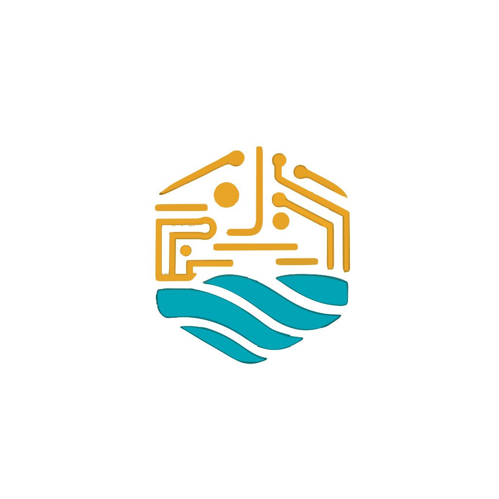
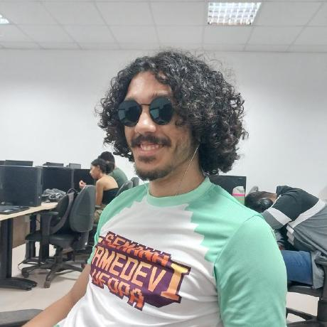

<p align="center">
  
</p>

<h1 align="center">RioHacks - Business Solutions, Innovation & Technology Landing Page</h1>


 is a professional **React / Next.js** landing page built with **Tailwind CSS** for a startup focused on local and regional innovation in **Santarém-PA, Brazil**. This landing page showcases business solutions, technological innovation services, and digital transformation consulting.

## About RioHacks

RioHacks is a startup dedicated to business solutions, innovation, and technology, specializing in digital transformation for companies in the Amazon region. We focus on creating customized software solutions, system integrations, AI/ML implementations, and comprehensive digital consulting services.

## Live demo

Check the live demo here 👉️ [ https://riohacks.com.br/]( https://riohacks.com.br/)

## Features

- **Modern Design**: Clean, professional interface optimized for business services
- **Responsive**: Fully responsive design that works on all devices
- **Service Showcase**: Comprehensive display of technology services offered
- **Client Portfolio**: Dynamic client showcase with modal interactions
- **Contact Integration**: Direct WhatsApp integration and contact forms
- **Hackatur Section**: Information about regional innovation events
- **Legal Pages**: Complete privacy policy and terms of service
- **Performance Optimized**: Built with Next.js 15 and optimized images

## Technology Stack

This project is built with:
- **Next.js 15** - React framework with App Router
- **React 18** - Modern React with Server Components
- **TypeScript** - Type-safe JavaScript
- **Tailwind CSS v4** - Utility-first CSS framework
- **Next/Image** - Optimized image loading
- **AOS** - Animate On Scroll library

## Usage

This is a [Next.js](https://nextjs.org/) project bootstrapped with [`create-next-app`](https://github.com/vercel/next.js/tree/canary/packages/create-next-app).

### Getting Started

First, run the development server:

```bash
npm run dev
# or
pnpm dev (recommended)
# or
yarn dev
```

Open [http://localhost:3000](http://localhost:3000) with your browser to see the result.

You can start editing the page by modifying `app/page.tsx`. The page auto-updates as you edit the file.

[API routes](https://nextjs.org/docs/api-routes/introduction) can be accessed on [http://localhost:3000/api/hello](http://localhost:3000/api/hello). This endpoint can be edited in `pages/api/hello.ts`.

The `pages/api` directory is mapped to `/api/*`. Files in this directory are treated as [API routes](https://nextjs.org/docs/api-routes/introduction) instead of React pages.

This project uses [`next/font`](https://nextjs.org/docs/basic-features/font-optimization) to automatically optimize and load Inter, a custom Google Font.

## Page Structure

```text
├── app/                 # Next.js App Router (main pages and routes)
│   ├── api/hello        # Example API route (sample endpoint for testing)
│   ├── css/             # Global and module-specific CSS files
│   ├── legal/           # Privacy policy and terms of service pages
├── components/          # Reusable React components
│   ├── ui/              # UI primitives and styled components
├── public/              # Static assets served at the site root
│   ├── fonts/           # Custom web fonts
│   ├── images/          # Landing page images
│   └── videos/          # Video files used on the site
├── extracted/           # Extracted or generated assets (e.g., temporary or build-related files)
└── utils/               # Helper functions and utility modules
```
## Available Scripts

- `npm run dev` - Start development server
- `npm run build` - Start production server
- `npm run start` - Start production server
- `npm run lint` - Run ESLint

### Learn More

To learn more about Next.js, take a look at the following resources:

- [Next.js Documentation](https://nextjs.org/docs) - learn about Next.js features and API.
- [React Documentation](https://react.dev/) - learn about React.
- [Tailwind CSS](https://tailwindcss.com/docs/installation/using-vite) - utility-first CSS framework.
- [TypeScript ](https://www.typescriptlang.org/docs/) - typed JavaScript.

### Deployment

The application is deployed on [Vercel Platform](https://vercel.com/new?utm_medium=default-template&filter=next.js&utm_source=create-next-app&utm_campaign=create-next-app-readme) with custom domain configuration pointing to riohacks.com.br through HostGator DNS management.

### For deployment details:

- **Plataform**: Vercel
- **Domain**: riohacks.com.br (configured via HostGator DNS)
- **Domain**: `npm run build`
- **Framework**: Next.js (auto-detected)

Check out our [Next.js deployment documentation](https://nextjs.org/docs/deployment) for more details.

### Development Team

This landing page was developed by:
<div align="center">
  <table>
    <tr>
      <td align="center" style="padding:20px;">
        
        <br><br>
        <b>Jheickson</b><br>
        <a href="https://github.com/Jheickson">GitHub</a><br>
        jheickson@protonmail.com<br>
        Front-end Developer
      </td>
      <td align="center" style="padding:20px;">
        
        <br><br>
        <b>Amiraldo Ferreira</b><br>
        <a href="https://github.com/amiralo01">GitHub</a><br>
        amiraldo.f19@gmail.com<br>
        Front-end Developer
      </td>
    </tr>
  </table>
</div>

## Support Notes

This template has been developed with the Next.js App Router and React Server Components. The codebase includes:

- Server and Client Components architecture
- Optimized image handling with next/image
- Responsive design patterns
- Accessibility considerations
- SEO optimization

## Terms and License

- Copyright 2025 RioHacks - Business Solutions, Innovation & Technology
- Use it for personal and commercial projects, but please don’t republish, redistribute, or resell the template.
- Attribution  is appreciated but not required.

## Contact

For business inquiries and services:
- **Website**: [https://riohacks.com.br/](https://riohacks.com.br/)
- **WhatsApp**: [+55 93 99196-3307](https://wa.me/5593991963307)
- **Location**: Av. Mendonça Furtado, 2417, Aldeia, Santarém/PA